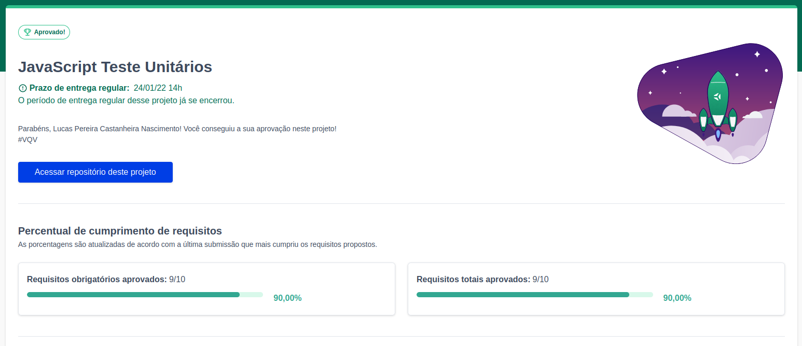

# JavaScript ES6 and Unit Tests

<h2>:brazil: Português :brazil:</h2>

Projeto entregue durante o curso de desenvolvimento Web ministrado pela <a href="https://www.betrybe.com" targe="_blank" rel="nofollow">Trybe</a>.

Obtive a aprovação no projeto, completando 90% dos requisitos obrigatórios e opcionais. Efetivando, assim, a conclusão do Bloco 7 (Introdução à JavaScript ES6 e Testes Unitários) referente ao Módulo 1 (Fundamentos do Desenvolvimento Web).

Descrição:

O projeto tinha como objetivo implementar várias funções para atender aos requisitos propostos e/ou testes unitários para garantir que as implementações das funções estão corretas.

Habilidades desenvolvidas

<ol>
<li>Escrever testes unitários para funções utilizando o módulo Jest do NodeJS para verificar o correto funcionamento dessas funções;</li>
<li>A partir de testes já implementados, escrever funções de forma que elas atendam aos testes propostos;</li>
<li>Escrever testes e funções utilizando uma abordagem de desenvolvimento orientado a testes.</li>
</ol>

<a href="https://www.linkedin.com/in/lucas-pereira-castanheira-nascimento-238355190/" targe="_blank" rel="nofollow">Meu Linkedin</a>.

 

<h2>:us: English :us:</h2>

Project delivered during the Web development course taught by <a href="https://www.betrybe.com" targe="_blank" rel="nofollow">Trybe</a>.

I passed the project, completing 90% of mandatory and optional requirements. Thus, completing Block 7 (Introduction to JavaScript ES6 and Unit Tests) referring to Module 1 (Fundamentals of Web Development).

Description:

The project aimed to implement various functions to meet the proposed requirements and/or unit tests to ensure that the implementations of the functions are correct.

Developed skills

<ol>
<li>Write unit tests for functions using the NodeJS Jest module to verify the correct functioning of these functions;</li>
<li>From tests already implemented, write functions so that they meet the proposed tests;</li>
<li>Write tests and functions using a test-driven development approach.</li>
</ol>

<a href="https://www.linkedin.com/in/lucas-pereira-castanheira-nascimento-238355190/" targe="_blank" rel="nofollow">My Linkedin</a>.

